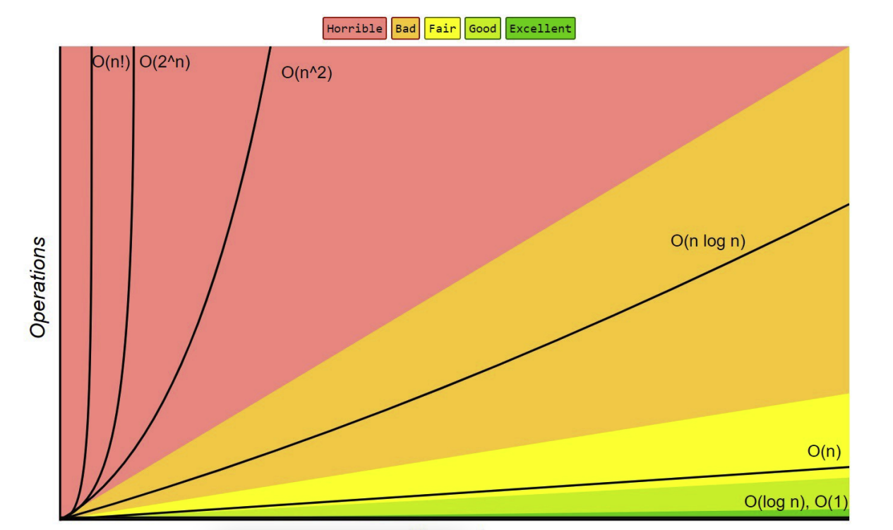

# Алгоритмы и структуры данных

## Содержание

- [1. Что такое сложность алгоритма?](#complexity)
- [2. Какие структуры данных существуют?](#structures)

### 1. Что такое сложность алгоритма? 

Сложность алгоритма — это функция, описывающая количество ресурсов (времени,
памяти), необходимых для его выполнения в
зависимости от размера входных данных.

#### Временная и пространственные сложности.

Временная сложность: показывает, как изменяется время выполнения алгоритма (
количество элементарных шагов) в зависимости
от размера входных данных. Обычно обозначается как функция от n — количества
входных элементов.

Пространственная сложность: показывает, сколько памяти (или пространства)
требуется алгоритму в зависимости от размера
входных данных. Так же, как и временная сложность, пространственная сложность
выражается как функция от n, где n —
размер входных данных.

#### О-нотация.

«O» большое — математические обозначения для
сравнения асимптотического поведения (асимптотики) функций.

Функция $`f(n)`$ является $`O(g(n))`$ (читается как «О от g(n)»), если
существуют положительные константы $`c`$ и $`n_0`$ такие, что
$`0 \leq f(n) \leq c \cdot g(n)`$ для всех $`n \geq n_0`$.

О-обозначения применяются, когда нужно указать верхнюю границу функции
с точностью до постоянного множителя.

#### Асимптотическая сложность.

Функция сложности временной алгоритма в некоторых случаях может быть определена
точно, в большинстве
случаев искать точное значение бессмысленно. Точное значение временной сложности
зависит
от определения элементарных операций (например, сложность можно измерять в
количестве арифметических операций, битовых
операций или операций на машине Тьюринга), а во-вторых, при увеличении размера
входных данных вклад постоянных
множителей и слагаемых низших порядков, фигурирующих в выражении для точного
времени работы, становится крайне
незначительным.

Рассмотрение входных данных большого размера и оценка порядка роста времени
работы алгоритма приводят к понятию
асимптотической сложности алгоритма. При этом алгоритм с меньшей асимптотической
сложностью является более эффективным
для всех входных данных, за исключением лишь, возможно, данных малого размера.

#### Примеры асимптотических сложностей.

- $`O(1)`$ — константная сложность.
- $`O(\log n)`$ — логарифмическая сложность.
- $`O(n)`$ — линейная сложность.
- $`O(n \log n)`$ — линейно-логарифмическая сложность.
- $`O(n^2)`$ — квадратичная сложность.
- $`O(n^3)`$ — кубическая сложность.
- $`O(2^n)`$ — экспоненциальная сложность.
- $`O(n!)`$ — факториальная сложность.

#### График сложностей.

### 2. Какие структуры данных существуют? 
